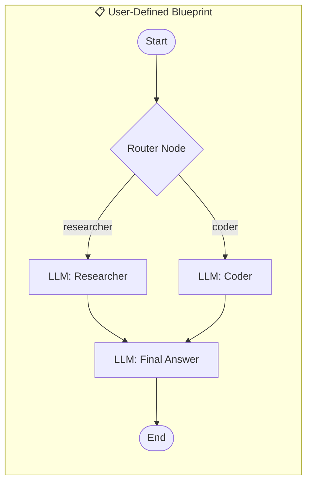
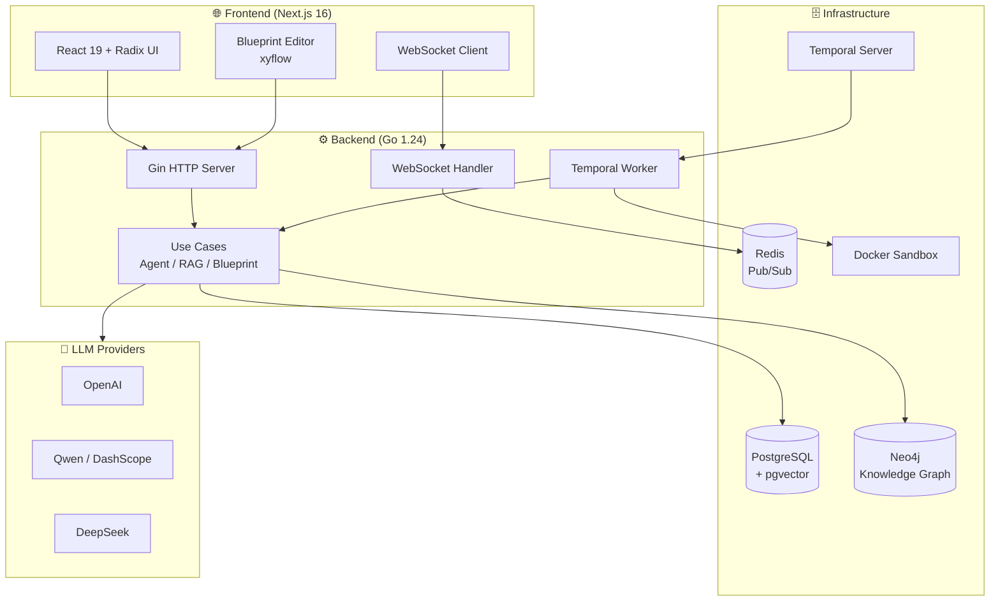

# 🏦 Fin-Nexus

<div align="center">

**A Production-Grade Financial AI Agent Platform**

[](https://go.dev/)
[](https://nextjs.org/)
[](https://www.docker.com/)
[](LICENSE)

</div>

> ⚠️ **Disclaimer**: This is a **personal learning project** built for educational purposes to explore modern AI agent architectures. Inspired by [Aime](https://github.com/aime-labs/aime). Not intended for production use.

---

## ✨ Features

- 🎨 **Visual Workflow Builder (Blueprints)** — The **core innovation** of this project: a drag-and-drop DAG editor for designing custom multi-agent pipelines without code
- 🤖 **Multi-Agent Orchestration** — Supervisor-Worker pattern powered by [Temporal](https://temporal.io/) for durable, resumable workflows
- 🧠 **Hybrid GraphRAG** — Combines Neo4j knowledge graph + pgvector semantic search + Jina reranking for deep financial reasoning
- 🐍 **Code Interpreter** — Secure Docker sandbox with `yfinance`, `pandas`, `matplotlib` for real-time quantitative analysis
- 🔐 **Multi-Provider LLM** — Support OpenAI, Qwen, DeepSeek with encrypted API key storage per node
- ⚡ **Real-time Streaming** — WebSocket + Redis Pub/Sub for token-by-token responses
- 📰 **Morning Brief** — Automated daily market summary with scheduled data ingestion

---

## 🎯 Highlight: Blueprint Workflow System

The **Blueprint** system is the most distinctive feature of Fin-Nexus. It allows users to visually design and execute custom AI agent workflows:



### Key Capabilities

| Feature | Description |
|:--------|:------------|
| **Node Types** | `Start`, `LLM`, `Router`, `Tool`, `End` — composable building blocks |
| **Per-Node LLM Config** | Each node can use different LLM providers (e.g., GPT-4 for reasoning, Qwen for Chinese) |
| **Conditional Routing** | Router nodes dynamically select the next agent based on LLM decisions |
| **Streaming Execution** | Real-time token streaming through the entire workflow pipeline |
| **Encrypted API Keys** | Blueprint-level and node-level API keys are AES-encrypted in database |
| **Visual Editor** | Frontend uses [xyflow](https://xyflow.com/) for intuitive drag-and-drop workflow design |

### How It Works

1. **Design** — Create nodes and edges in the visual editor
2. **Configure** — Set system prompts, LLM providers, and routing conditions per node  
3. **Execute** — Run the workflow via WebSocket; Temporal orchestrates the DAG traversal
4. **Stream** — Each node's output streams to the frontend in real-time

---


## 🏗️ Architecture



---

## 🛠️ Tech Stack

| Component | Technology | Purpose |
|:----------|:-----------|:--------|
| **Backend** | Go 1.24 + Gin | High-concurrency API server |
| **Frontend** | Next.js 16 + React 19 | Modern web interface |
| **Workflow** | Temporal | Durable task orchestration |
| **Vector DB** | PostgreSQL + pgvector | Semantic document search |
| **Graph DB** | Neo4j 5.x | Knowledge graph storage & traversal |
| **Cache** | Redis | Session cache & Pub/Sub |
| **Tracing** | OpenTelemetry + Jaeger | Distributed tracing |
| **Sandbox** | Docker API | Secure Python code execution |
| **LLM** | OpenAI / Qwen / DeepSeek | AI reasoning & embeddings |
| **Reranker** | Jina AI | Document relevance scoring |

---

## 🚀 Quick Start

### Prerequisites

- Docker & Docker Compose
- Go 1.24+ (for local development)
- Node.js 20+ (for frontend)

### 1. Clone & Configure

```bash
git clone https://github.com/ArthurWang23/go-nexus.git
cd go-nexus

# Create .env file with your API keys
cp .env.example .env
```

### 2. Configure Environment Variables

Create a `.env` file in the project root:

```bash
# LLM Configuration (Required)
LLM_API_KEY=your-llm-api-key
LLM_BASE_URL=https://api.openai.com/v1
LLM_MODEL=gpt-4o
LLM_EMBEDDING_MODEL=text-embedding-3-small

# External Services (Required)
JINA_API_KEY=your-jina-api-key
TAVILY_API_KEY=your-tavily-api-key

# Security (generate with: openssl rand -hex 32)
API_KEY_MASTER_KEY=your-32-byte-hex-key
```

### 3. Start Services

```bash
# Start all infrastructure (Neo4j, PostgreSQL, Redis, Temporal, Jaeger)
docker-compose up -d
```

### 4. Start Frontend (Optional)

```bash
# Clone frontend repository
git clone https://github.com/ArthurWang23/fin-nexus-web.git
cd fin-nexus-web

npm install
npm run dev
```

Visit: **http://localhost:3000**

---

## 📁 Project Structure

```
go-nexus/
├── cmd/
│   ├── server/          # HTTP server entrypoint
│   └── cli/             # TUI client (Bubble Tea)
├── internal/
│   ├── domain/          # Entities, value objects, repository interfaces
│   ├── usecase/         # Business logic (Agent, RAG, Blueprint)
│   │   ├── tools/       # Agent tools (Python, Search, etc.)
│   │   ├── gateway/     # External service interfaces
│   │   └── repo/        # Repository interfaces
│   ├── delivery/
│   │   └── http/        # Gin handlers & middleware
│   ├── infrastructure/  # External implementations
│   │   ├── llm/         # LLM adapters (OpenAI, Jina)
│   │   ├── graph/       # Neo4j repository
│   │   ├── persistence/ # PostgreSQL repositories
│   │   └── search/      # Tavily search client
│   └── workflow/        # Temporal workflows & activities
├── orchestrator/        # TypeScript Temporal worker (alternative)
├── pkg/                 # Shared utilities
├── configs/             # Configuration files
├── docker/              # Dockerfiles
└── docker-compose.yml   # Full stack orchestration
```

---

## 🔌 API Overview

### REST Endpoints

| Method | Endpoint | Description |
|:-------|:---------|:------------|
| `POST` | `/api/v1/register` | User registration |
| `POST` | `/api/v1/login` | User authentication |
| `GET` | `/api/v1/sessions` | List chat sessions |
| `GET` | `/api/v1/sessions/:id` | Get session history |
| `POST` | `/api/v1/upload` | Upload document to RAG |
| `GET` | `/api/v1/blueprints` | List workflow blueprints |
| `POST` | `/api/v1/blueprints` | Create blueprint |
| `GET` | `/api/v1/config` | Get model configurations |

### WebSocket Protocol

Connect to `/api/v1/ws/chat?token=<jwt>` for real-time streaming.

**Event Types:**
- `thinking` — Agent reasoning steps
- `stream` — Token-by-token response
- `agent` — Blueprint node outputs
- `done` — Workflow completed
- `error` — Error occurred

---

## 🎨 Frontend Repository

The web interface is maintained in a separate repository:

**[fin-nexus-web](https://github.com/ArthurWang23/fin-nexus-web)** — Next.js 16 + React 19 + Radix UI + xyflow

Features:
- 🌌 Aurora background with glassmorphism design
- 📊 Interactive Blueprint workflow editor
- 💬 Real-time streaming chat interface
- 🌙 Dark mode with modern aesthetics

---

## 🙏 Acknowledgments

This project is inspired by:
- [Aime](https://github.com/aime-labs/aime) — My Stock AI Assistant provided by AInvest
- [LangGraph](https://github.com/langchain-ai/langgraph) — For workflow orchestration ideas
- [Temporal](https://temporal.io/) — For durable execution patterns

---

## 📄 License

This project is licensed under the MIT License - see the [LICENSE](LICENSE) file for details.

---

<div align="center">

**Built with ❤️ as a learning project**

</div>
